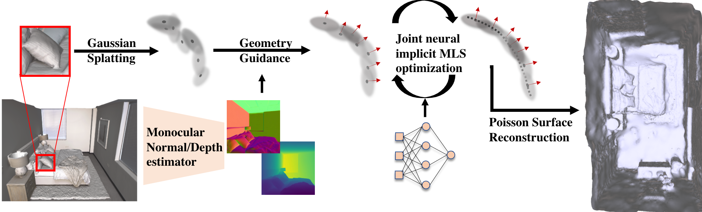

# Surface Reconstruction from 3D Gaussian Splatting via Local Structural Hints

[[`Project Page`](https://wuqianyi.top/gsrec)][[`arxiv`]()]


## Overview
<p align="center">

</p>

We introduce GSrec, which aims to design a surface-aligned Gaussian Splatting and benefits the surface reconstruction.

Key idea: Monocular geometry guidance to augment 3DGS with normal attributes, then use neural implicit representation to joint optimize the moving least square field formed by the 3DGS as regularization.


## Installation

We tested on a workstation configured with Ubuntu 22.04, cuda 11.6 and gcc 9.5.

1. Clone this repo:
```
git clone https://github.com/QianyiWu/gsrec --recursive
cd gsrec
```

2. Install dependencies
```
conda env create --file environment.yml
conda activate gsrec
```

## Data

We provided our [preprocessed Replica](https://drive.google.com/file/d/1PGW0D7Sy5H7KRrRSXhVx3qcI9Y8AU8q1/view?usp=drive_link) dataset (8 scenes, ~1.7GB) for reference. You can download the dataset and put it in the ```data``` folder. The data structure similar to other 3DGS project and will be organised as follows:

```
data/
├── dataset_name ("replica" in this case)
│   ├── scan1/
│   │   ├── images
│   │   │   ├── IMG_0.jpg
│   │   │   ├── IMG_1.jpg
│   │   │   ├── ...
│   │   ├── sparse/
│   │       └──0/
│   ├── scan2/
│   │   ├── images
│   │   │   ├── IMG_0.jpg
│   │   │   ├── IMG_1.jpg
│   │   │   ├── ...
│   │   ├── sparse/
│   │       └──0/
...
```

### Custom Data

For custom data, you should process the image sequences with [Colmap](https://colmap.github.io/) to obtain the SfM points and camera poses. Then, place the results into ```data/``` folder.


## Training

For training a single scene, take scan1 from Replica as example:
```
./train_single.sh
```
It will save the results into ```outputs/scan1```. The training should take about 1 hours till the end.


## Evaluation
You can use the following code to extract mesh. Take the outputs from previous steps as example:
```
python extract_mesh.py -m outputs/scan1 --mesh_type poisson
```

## Citation

If you find our work helpful, please consider citing:

```bibtex
@inproceedings{Wu2024gsrec,
        author    = {Wu, Qianyi and Zheng, Jianmin and Cai, Jianfei},
        title     = {Surface Reconstruction from 3D Gaussian Splatting via Local Structural Hints},
        booktitle = {European Conference on Computer Vision},
        year      = {2024}
    }
```

## LICENSE

Please follow the LICENSE of [3D-GS](https://github.com/graphdeco-inria/gaussian-splatting).

## Concurent Works
Surface reconstruction for 3DGS is a very important task and we found several concurrent works along this direction. You can check the [``Related links``](https://wuqianyi.top/gsrec) in our project page. These works are super cool and insightful.

## Acknowledgement

We thank all authors from [3D-GS](https://github.com/graphdeco-inria/gaussian-splatting) for presenting such an excellent work. We also thanks all the authors from [Scaffold-GS](https://arxiv.org/abs/2312.00109), which we choose it as base model. 